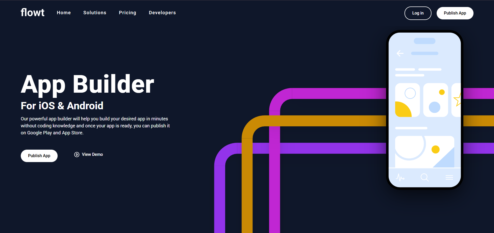

Flowt Landing Page

Responsive landing page built with HTML, CSS, and JavaScript.

🚀 Features
- Fully responsive (mobile, tablet, desktop)
- Clean and structured code
- Pixel-perfect layout
- Cross-browser compatibility

🛠 Technologies
- HTML5
- CSS3 (Flexbox, Grid)
- JavaScript

🔗 Live Demo
https://danilshenko.github.io/Flowt/

📂 GitHub Repository
https://github.com/Danilshenko/Flowt

📸 Preview

### Desktop

### Mobile
